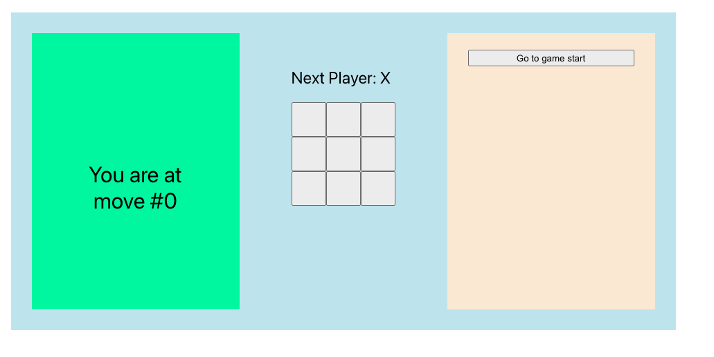
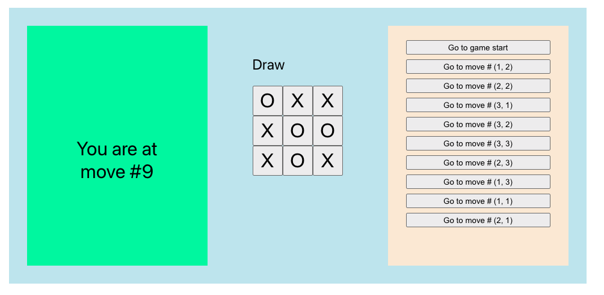
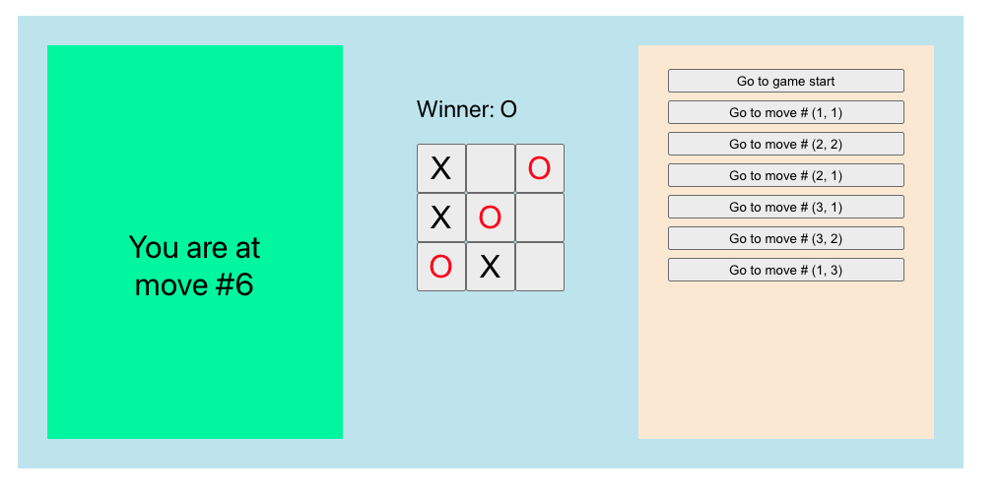

# 介绍

这是一个基于 React 实现的小游戏--井字棋游戏

React 官网教程：https://zh-hans.react.dev/learn/tutorial-tic-tac-toe

### 基本功能实现

1. 井字棋游戏基本实现
2. 胜利提示
3. 回顾游戏历史，查看之前的步骤

### 升级功能实现

1. 仅针对当前着手，显示“You are at move #…”而不是按钮。
2. 重写 Board 以使用两个循环来制作方块而不是对它们进行硬编码。
3. 添加一个切换按钮，使可以按升序或降序对落子的步数进行排序。
4. 当有人获胜时，突出显示致使获胜的三个方块（当没有人获胜时，显示一条关于结果为平局的消息）。
5. 在“落子”的历史列表中以 (row, col) 格式显示每步的位置。

# 技术细节

### 一、组件块结构

由三个组件块构成：Game(顶级组件)-->Broad(棋盘组件)-->Square(棋盘上的每一个按钮组件)

1. 构建棋盘
   可以有两种方式:
   一种是硬编码

```js
<div className='row'>
    <Square value={squares[0]} handleSquareClick={() => handleClick(0)} />
    <Square value={squares[1]} handleSquareClick={() => handleClick(1)} />
    <Square value={squares[2]} handleSquareClick={() => handleClick(2)} />
    </div>
    <div className='row'>
    <Square value={squares[3]} handleSquareClick={() => handleClick(3)} />
    <Square value={squares[4]} handleSquareClick={() => handleClick(4)} />
    <Square value={squares[5]} handleSquareClick={() => handleClick(5)} />
    </div>
    <div className='row'>
    <Square value={squares[6]} handleSquareClick={() => handleClick(6)} />
    <Square value={squares[7]} handleSquareClick={() => handleClick(7)} />
    <Square value={squares[8]} handleSquareClick={() => handleClick(8)} />
    </div>
</div>
```

一种是循环制作, 采用数组遍历的方式：

```js
function renderSquare(i) {
  return <Square value={squares[i]} handleSquareClick={() => handleClick(i)} />;
}

const drawSquare = [0, 1, 2].map((row, rowIndex) => {
  return (
    <div className="row">
      {[0, 1, 2].map((col, colIndex) => {
        return renderSquare(row * 3 + col);
      })}
    </div>
  );
});
return (
  <div className="App">
    <div className="content">{content}</div>
    {drawSquare}
  </div>
);
```

### 二、state 状态的声明 和 props 数据流

这边一共用到了两种类型的状态：一是对于棋盘中的每一步都要保存下来的 squareList 状态，二是保存当前在走哪一步的 currentMove 状态，还有一个状态是 xIsNext，即判断下一次的落子是不是 X，不过这个状态可以不声明，因为 xIsNext 可以通过 currentMove 来计算，即 $xIsNext = (currentMove \% 2 === 0) $, 这样就可以避免冗余的 state，简化代码减少出错。

还有一个需要保存的状态是 isDraw , 即是否平局的状态，也是可以通过 currentMove 来计算的。$ isDraw = currentMove > 8 ? true : false $

这边的 props 数据流都是单向的，即都是从父组件向子组件传递。需要传递的是一些状态，也有子组件向父组件传递的，如下面的 onplay 的 props:

```js
function handlePlay(newSquares) {}
// 父组件
<div className="broad">
  <Broad
    xIsNext={xIsNext}
    squares={squares}
    onPlay={handlePlay}
    isDraw={isDraw}
  />
</div>;

// 子组件向父组件传递数据
onPlay(newSquares);
```

### 三、部分升级功能实现

#### 1. 当有人获胜时，突出显示致使获胜的三个方块（当没有人获胜时，显示一条关于结果为平局的消息）

计算是否获胜的 fuction，返回一个对象：{square: square[a], line: list[i]}, 前者代表获胜者，后者代表获胜的块的 index

重写 Square 组件

```js
// heightlight判断当前块是否是获胜块
function Square({ value, handleSquareClick, heightlight }) {
  if (heightlight) {
    return (
      <button
        className="square"
        onClick={handleSquareClick}
        style={{ color: "red" }}
      >
        {value}
      </button>
    );
  } else {
    return (
      <button className="square" onClick={handleSquareClick}>
        {value}
      </button>
    );
  }
}

// Broad父组件
function renderSquare(i) {
  return (
    <Square
      value={squares[i]}
      handleSquareClick={() => handleClick(i)}
      heightlight={winner.line.includes(i)}
    />
  );
}
```

#### 2. 在“落子”的历史列表中以 (row, col) 格式显示每步的位置

声明一个状态 position，保存每一步走的位置，与 squareList 同步更新

在渲染历史按钮的时候，计算 row 和 col

```js
const row = parseInt(position[move] / 3) + 1;
const col = (position[move] % 3) + 1;
if (move > 0) {
  // desription = "Go to move #" + move;
  desription = "" + `Go to move # (${row}, ${col})`;
}
```

# 成果展示

初始状态

平局的时候

赢的时候

